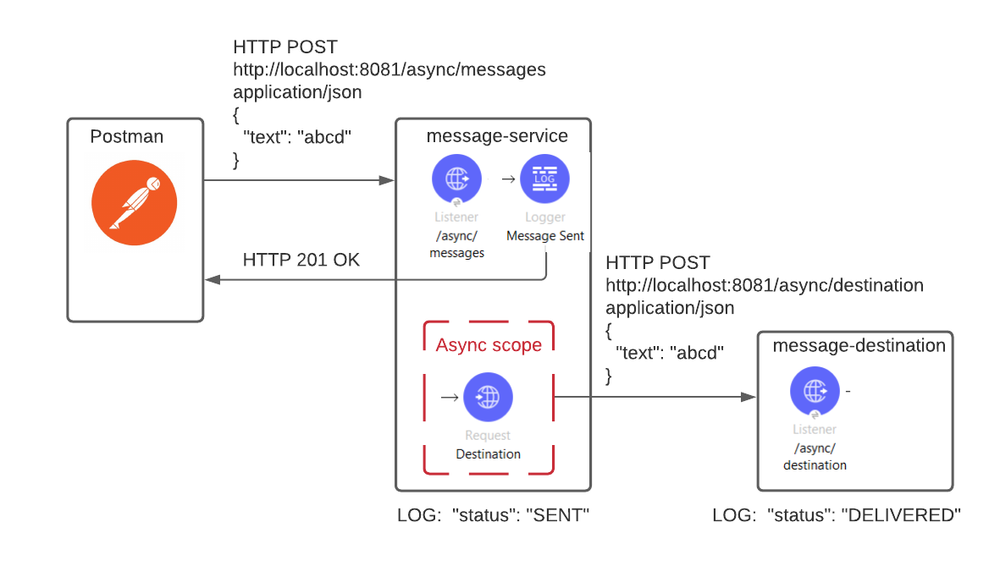

# uc-async-scope

### Asynchronous Message Delivery




The flow receives a message through HTTP connector immediately responds OK.
Then the flow asynchronously processes the message and retransmits it to the destination. 

Set Postman for a POSt request
```
POST
http://localhost:8081/async/messages
application/json
{
  "text": "abcd"
}
```
After sending the message the flow will print

```
{ "status": "SENT",
  "message": "{\n  \"text\": \"abcd\"\n}",
  "timestamp": "2021-08-24T12:21:05.446+06:00"
}
```
And after some time, which imitated processing and transportation time
```
{
  "status": "DELIVERED",
  "message": "{\n  \"text\": \"abcd\"\n}",
  "timestamp": "2021-08-24T12:21:15.512+06:00"
}
```

#### Pros:
- improves responsiveness
#### Cons:
- overhead for requester if it needs a delivery report or a processed object as a response
- not a reliable delivery, message lost in power off
- possible message lost in case of a request spike