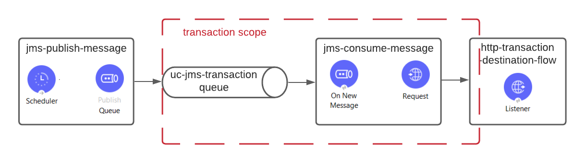

# uc-jms-transaction

### Consuming messages from JMS queue 

A message is published in a persistent queue.
Then, a JMS client is trying to consume the message and send it to an HTTP endpoint.
The message will be consumed and deleted from the queue only if the endpoint returns HTTP OK response.
The queue allows several attempts for reading the message with a given time interval.
When the client exceeds the number of retry attempts, the message is redirected to a DLQ.
