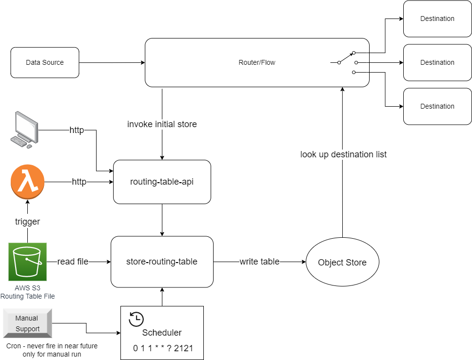
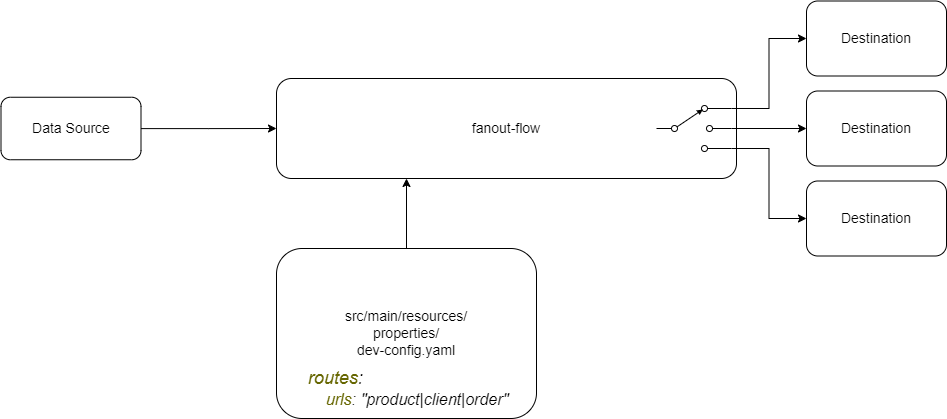

# uc-mule-router
### Using Object Store as a Routing Table with external file source

Mule reads routing table from AWS S3 and writes it in an object store.

#### Updating is possible when:

- initial router run, checking isActual flag and then invoking "store-routing-table"
- detecting S3 changes and trigger lambda invocation of "store-routing-table"
- manually starting "store-routing-table" through Runtime Management page

The scheduler has "unreachable" in near future cron and is supposed to be run only manually

### Using properties as a list of destinations (fanout)

#### Several Destinations without Updating

- property has URLs with a delimiter