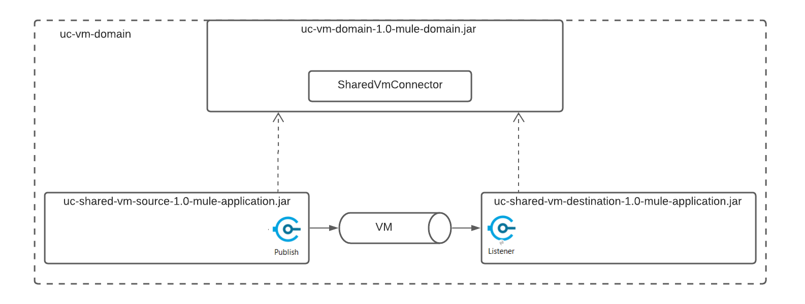

# uc-shared-vm

### Using Domain for Shared VM connector configuration

Two separate applications use shared VM queue for data exchange

##### Set Run Configuration for starting the Domain and two apps

Run it!

#### Pros:
- no additional external message broker

#### Cons:
- only for On-Premises Mule Runtime, not for cloud